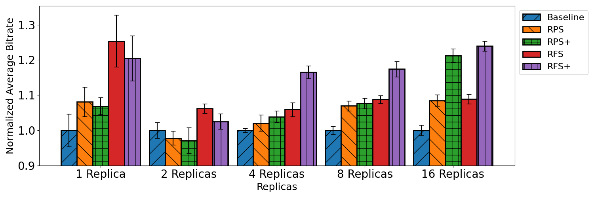
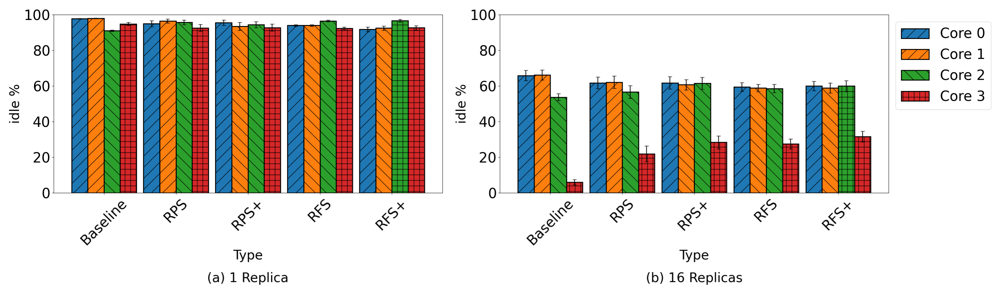
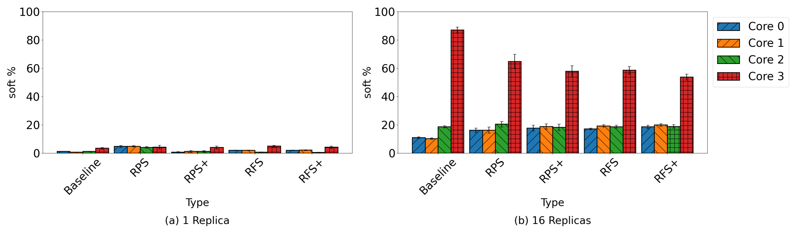

# Accelerated Flow Processing in Kubernetes Overlay Networks

This repository contains the implementation and experimental setup for evaluating Receive Packet Steering (RPS) and Receive Flow Steering (RFS) optimizations in Kubernetes overlay networks, as described in our research paper.

## Overview

This project evaluates the performance benefits of RPS and RFS optimizations in VXLAN-based Calico overlay networks. The experiments measure network throughput, CPU utilization, and software interrupt handling across different configurations and replica counts.

### Overlay Network Architecture

Calico uses VXLAN encapsulation to enable pod-to-pod communication across different hosts in a Kubernetes cluster. The overlay network creates a virtual Layer 2 network that allows pods to communicate using their private IP addresses, with packets being encapsulated/decapsulated as they traverse the physical network.

> **Note:** If you have a diagram showing the Calico overlay network packet flow (encapsulation/decapsulation process), you can add it here as `docs/images/overlay_network.png`

## Repository Structure

```
accel-overlay-nw/
├── scripts/                    # Experiment deployment and execution scripts
│   ├── deploy_experiment.sh    # Baseline experiment deployment
│   ├── deploy_experiment_rps.sh
│   ├── deploy_experiment_rfs.sh
│   ├── deploy_experiment_rps_7.sh
│   ├── run_experiments.sh      # Run baseline experiments (20 iterations)
│   ├── run_experiments_rps.sh
│   ├── run_experiments_rfs.sh
│   ├── run_experiments_rps_7.sh
│   ├── enable_rps.sh           # Enable RPS on host interfaces
│   ├── enable_rfs.sh           # Enable RFS on host interfaces
│   ├── disable_rps.sh          # Disable RPS on host interfaces
│   └── disable_rfs.sh          # Disable RFS on host interfaces
│
├── docker/                      # Docker images for container-level optimizations
│   ├── rps/                     # RPS-enabled iperf3 container
│   │   ├── Dockerfile
│   │   ├── enable_rps.sh
│   │   └── entrypoint.sh
│   ├── rfs/                     # RFS-enabled iperf3 container
│   │   ├── Dockerfile
│   │   ├── enable_rfs.sh
│   │   └── entrypoint.sh
│   └── rps-7/                   # RPS-7 variant container
│       ├── Dockerfile
│       ├── enable_rps.sh
│       └── entrypoint.sh
│
├── kubernetes/                  # Kubernetes deployment configurations
│   └── helm-charts/
│       ├── client/              # iperf3 client Helm chart
│       ├── server/              # Baseline server Helm chart
│       ├── server-rps/          # RPS-enabled server Helm chart
│       ├── server-rfs/          # RFS-enabled server Helm chart
│       └── server-rps-7/        # RPS-7 variant server Helm chart
│
├── data/                        # Experimental results
│   └── results/                 # Raw experiment output files
│       ├── baseline-*.txt      # Baseline experiment results
│       ├── rps-*.txt            # RPS experiment results
│       ├── rps-plus-*.txt       # RPS+ (host + container) results
│       ├── rfs-*.txt            # RFS experiment results
│       ├── rfs-plus-*.txt       # RFS+ (host + container) results
│       └── rps-7-*.txt          # RPS-7 variant results
│
├── analysis/                    # Data analysis and visualization
│   └── data_parse/
│       ├── generate.py          # Python script for generating plots
│       ├── finalized_*.csv      # Processed data files
│       ├── confidence_*.csv     # Confidence interval data
│       └── *.png                # Generated plots and figures
│
└── docs/                        # Documentation
    └── (research paper)
```

## Prerequisites

- Kubernetes cluster (v1.31.1) with `kubeadm`
- Calico CNI plugin configured with VXLAN encapsulation
- Helm 3.x
- `kubectl` configured to access your cluster
- SSH access to worker nodes
- Docker (for building custom images)
- Python 3.x with pandas and matplotlib (for data analysis)

## Experimental Setup

The experiments use a Kubernetes cluster with:
- 3 nodes (1 control plane, 2 worker nodes)
- Each VM: 4 cores, 8 GB RAM
- Ubuntu 22.04 LTS
- Calico CNI with VXLAN encapsulation

> **Note:** If you have a diagram of the experiment setup, you can add it here as `docs/images/experiment_setup.png`

### Node Configuration

Label your worker nodes appropriately:
```bash
kubectl label nodes <server-node> iperf=server
kubectl label nodes <client-node> iperf=client
```

## Building Docker Images

Build the custom iperf3 images with RPS/RFS support:

```bash
# Build RPS image
cd docker/rps
docker build -t srinva/iperf-rps:latest .

# Build RFS image
cd ../rfs
docker build -t srinva/iperf-rfs:latest .

# Build RPS-7 image
cd ../rps-7
docker build -t srinva/iperf-rps-7:latest .
```

Push to your container registry if needed:
```bash
docker push srinva/iperf-rps:latest
docker push srinva/iperf-rfs:latest
docker push srinva/iperf-rps-7:latest
```

## Running Experiments

### 1. Enable Host-Level Optimizations

Before running experiments, enable RPS or RFS on the server node's network interfaces:

```bash
# Enable RPS
./scripts/enable_rps.sh

# Enable RFS
./scripts/enable_rfs.sh

# Disable optimizations
./scripts/disable_rps.sh
./scripts/disable_rfs.sh
```

**Note:** The scripts configure RPS/RFS on:
- `eth1` (virtual NIC)
- `vxlan.calico` (VXLAN interface)
- `cali*` (Calico pod interface)

You may need to adjust interface names in the scripts based on your setup.

### 2. Run Baseline Experiments

```bash
# Single experiment with 4 replicas
./scripts/deploy_experiment.sh 4 <server-node-ip>

# Run 20 iterations for statistical significance
./scripts/run_experiments.sh 4 <server-node-ip> > data/results/baseline-4.txt
```

### 3. Run RPS Experiments

```bash
# Enable RPS first
./scripts/enable_rps.sh

# Run experiments
./scripts/run_experiments_rps.sh 4 <server-node-ip> > data/results/rps-4.txt
```

### 4. Run RFS Experiments

```bash
# Enable RFS first
./scripts/enable_rfs.sh

# Run experiments
./scripts/run_experiments_rfs.sh 4 <server-node-ip> > data/results/rfs-4.txt
```

### 5. Run RPS+ and RFS+ Experiments

For container-level optimizations (RPS+ and RFS+), use the corresponding Helm charts:

```bash
# RPS+ uses server-rps chart (host + container RPS)
helm upgrade --install accel-overlay-nw-server-rps ./kubernetes/helm-charts/server-rps --set replicas=4

# RFS+ uses server-rfs chart (host + container RFS)
helm upgrade --install accel-overlay-nw-server-rfs ./kubernetes/helm-charts/server-rfs --set replicas=4
```

## Experiment Configurations

The repository evaluates five configurations:

1. **Baseline**: No RPS or RFS optimizations
2. **RPS**: RPS enabled on host interfaces only
3. **RPS+**: RPS enabled on host interfaces and container interfaces
4. **RFS**: RFS enabled on host interfaces only
5. **RFS+**: RFS enabled on host interfaces and container interfaces

Each configuration is tested with replica counts: 1, 2, 4, 8, and 16 client-server pairs.

## Data Analysis

Process experimental results and generate plots:

```bash
cd analysis/data_parse
python generate.py
```

This generates:
- `bitrateresults1.png`: Normalized average bitrate comparison
- `1_idle_16_idle.png`: CPU idle percentage for 1 and 16 replicas
- `1_soft_16_soft.png`: CPU softirq percentage for 1 and 16 replicas

### Performance Results



*Figure: Normalized average bitrate for different number of replicas across all optimization configurations. RFS+ shows the best performance improvement, especially at higher replica counts.*



*Figure: Average idle CPU percentage by cores for each optimization with (a) a single replica and (b) 16 replicas. Note the improved load balancing with optimizations enabled.*



*Figure: Average CPU percentage used for software interrupts by cores for each optimization with (a) a single replica and (b) 16 replicas. Optimizations reduce the softirq load on Core 3.*

## Performance Metrics

The experiments measure:

1. **Normalized Average Bitrate**: Network throughput normalized to baseline
2. **CPU Idle Percentage**: Percentage of time each CPU core is idle
3. **CPU Softirq Percentage**: Percentage of time each CPU core processes software interrupts

All metrics are collected over 20 runs with 95% confidence intervals.

## Key Findings

Based on our experimental evaluation, we observe the following:

- **RFS+** provides the best performance improvement (up to 24% over baseline) with 16 replicas
- **RFS** and **RPS** show marginal improvements (8-9%) when enabled only at the host level
- Performance improvements increase with the number of replicas (more flows)
- Overlay networks have inherent limitations with flow-level parallelization due to non-protocol processing overhead

The performance results demonstrate that:
1. **Single-flow scenarios** (1 replica) show minimal benefit from flow-level parallelization, as expected
2. **Multi-flow scenarios** (16 replicas) show significant improvements, with RFS+ achieving the best results
3. **CPU utilization** is better balanced across cores when optimizations are enabled, reducing the bottleneck on Core 3
4. **Container-level optimizations** (RPS+, RFS+) provide additional benefits over host-only configurations at higher replica counts

## Troubleshooting

### Permission Issues
Container-level optimizations require privileged containers. Ensure your Helm charts have:
```yaml
securityContext:
  privileged: true
  runAsUser: 0
```

### Interface Names
If interface names differ, update the scripts in `scripts/` and `docker/*/enable_*.sh` to match your environment.

### SSH Access
Ensure passwordless SSH access to worker nodes for mpstat data collection.

## Citation

If you use this code in your research, please cite our paper:

```bibtex
@inproceedings{accel-overlay-nw,
  title={Accelerated Flow Processing in Kubernetes Overlay Networks},
  author={Vasudevan, Srinath and Diyora, Anjan and Harfoush, Khaled},
  booktitle={IEEE Conference},
  year={2024}
}
```

## License

This project is provided for research purposes. Please refer to the paper for detailed methodology and results.

## Contact

For questions or issues, please open an issue on GitHub or contact the authors.

## Acknowledgments

This work was conducted at North Carolina State University, Department of Computer Science.

